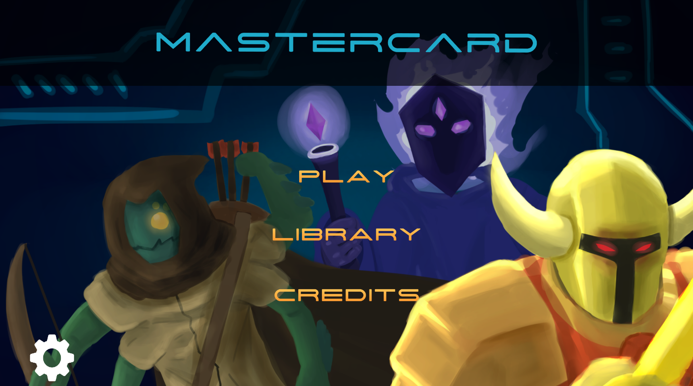

# MasterCard
This repository contains the code for National University of Singapore (NUS) Orbital Team MaStErCaRd's game.

MasterCard a Single-Player survival based card game. With the storyline of a NUS Computer Science Undergraduate receiving his semster result, we hope to that this game would be able to resonate with fellow NUS Computer Science Students allowing them to play this game as a way to destress.

## Table of content

- [Installation](#installation)
    - [Android User](#android-user)
    - [Non-Android User](#non-andriod-user)
    - [No Installation?](#no-installation)
- [Developers](#developers)
- [Special Thanks](#special-thanks)
- [Links](#links)

## Installation

Download the game apk file [here](https://drive.google.com/drive/folders/1o4PbgfO9W48qkN4bBzEFSIHirS-WezAj).

### Android User

Step 1 : [Enable APK installs](https://www.expressvpn.com/support/vpn-setup/enable-apk-installs-android/) on your Android device. 

Step 2: Search for the downloaded APK file in your downloads folder and install it.

Upon completion of installation, the game icon should appear on your phone.

### Non-Android User

For non-android user, you will need an android emulator in order to run the apk game file. Please read the guide [here](https://docs.google.com/presentation/d/1zs0ICmUpLg1rmO4ISOh4r5WJZJ7-3DZS0RtjeL9rN8Q/edit?usp=sharing) to install an emulator and the game.

## No Installation?

Not willing to install this game on your phone or emulator? Don't worry play our game online through your computer. Try out the WebGL Build hosted on Github <a>here</a>.

## Developers
* Png Yi Wei Jonas
* Koh Wei Quan Norman

## Special Thanks
* Lim En Qi Angie (Advisor)
* Wang Yu Wei (Artist)

## Links
* [Project Documentation](https://docs.google.com/document/d/13ATCrpXiTFcSEC14VbHSJakV83VcS0wtFuaobb8b5Wk/edit?usp=sharing)
* [Project Video](https://www.canva.com/design/DAFEVYIOF44/p7dBtfHG1rRzQNNYhEZrLQ/watch?utm_content=DAFEVYIOF44&utm_campaign=designshare&utm_medium=link2&utm_source=sharebutton)
* [Project Poster](https://drive.google.com/file/d/14NHZjo17mizy6xOxhIHJwp8MW9z-vCyg/view?usp=sharing)
